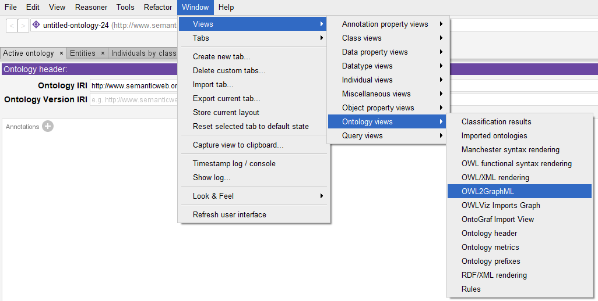

# OWL2GraphML

## Introduction

OWL2GraphML is a tool to generate a GraphML formatted graph from OWL ontologies. The tool used the [OWL-API](https://github.com/owlcs/owlapi) to read ontologies and it can be used as plugin for [Protégé](https://protege.stanford.edu) (tested for version 5).
The original creator of this tool is [Alexandr Uciteli](https://www.imise.uni-leipzig.de/en/Mitarbeiter/Alexandr_Uciteli) from the [Onto-Med](http://www.onto-med.de) research group at the [Institute for Medical Informatics, Statistics and Epidemiology](https://www.imise.uni-leipzig.de/en) of the University of Leipzig.

## How to use

There are two different ways to use this tool. You can add it as a new view to be used in Protégé or you can access the methods of this tool directly by adding it as dependency to your Java project.

### Use as Protégé plugin

Download one of our releases and place the JAR file inside the `plugins` directory of Protégé. After restarting Protégé, a new entry "OWL2GraphML" appears in the `Window > Views > Ontology views` context menu.



### Usage in Java application

Add OWL2GraphMl as dependency to your project.

Create an instance of the `MainOntology` class:
```java
MainOntology mo = new MainOntology(
	ontology,                            // an OWLOntology instance
	"https://example.org/example#Thing", // IRI of the class you want to use as root of the graph
	"down",                              // direction in which classes should be harvested from the ontology (allowed are "up" and "down")
	5                                    // maximum depth for class harvesting
);
``` 

Set additional properties to manipulate the resulting GraphML:
```java
mo.addTaxonomy();                         // add taxonomy to graph
mo.addAnnotations();                      // add annotation properties to graph
mo.addPropertyRestrictionSuperClasses();  // add superclasses of the property restrictions to the graph
mo.addEquivalentClasses();                // add equivalent classes to graph
mo.addIndividuals();                      // add individuals to graph
mo.addIndividualTypes();                  // add individual types to graph
mo.addIndividualAssertions();             // add individual assertion axioms to graph
mo.addPropertyDefinitions();              // add property definitions to graph
```

Write resulting GraphML to file:
```java
mo.toXml()                 // create an XML instance
    .writeXML(outputFile); // write XML to the specified file
```

## References

*- pending -*
